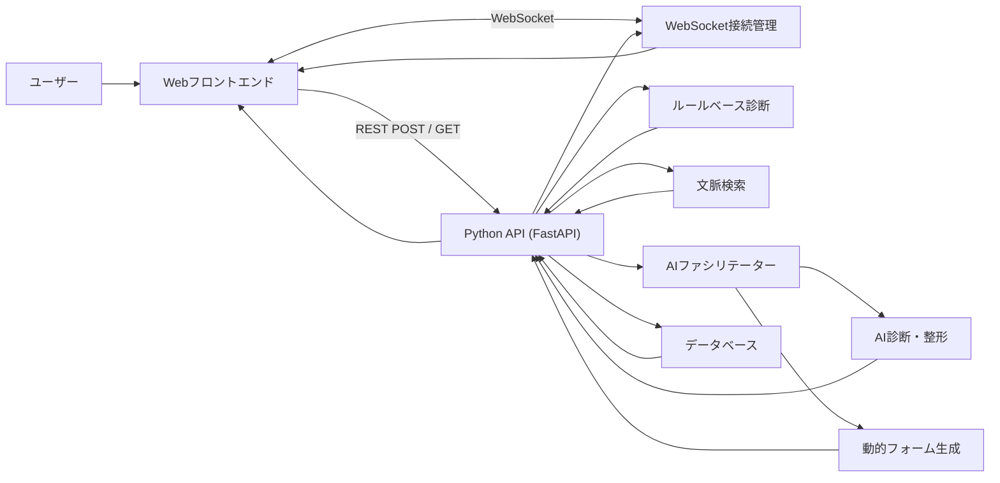
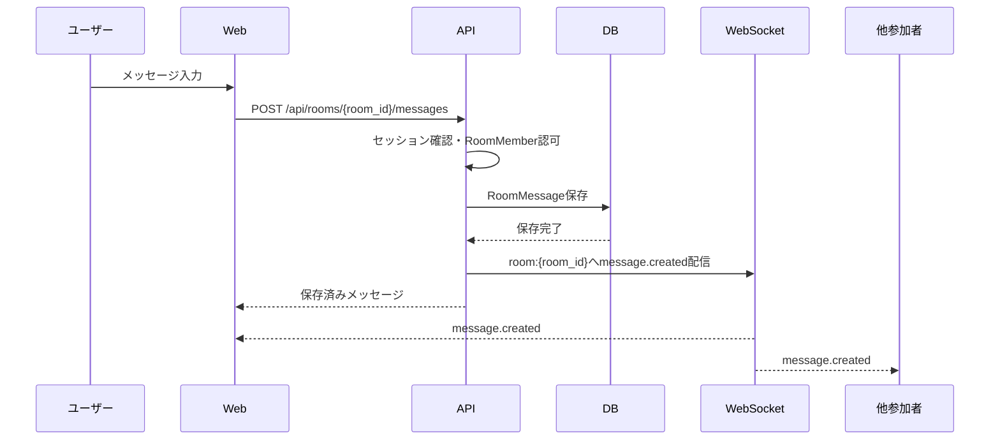
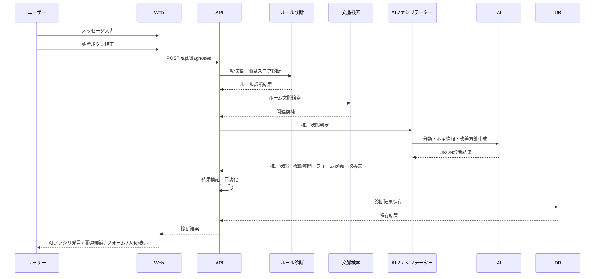
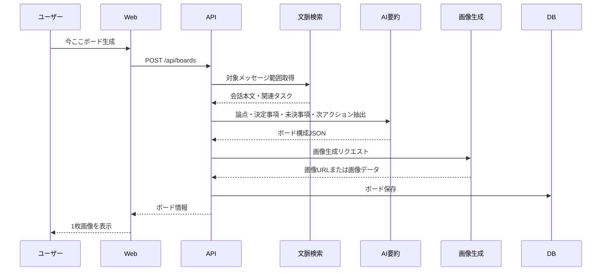
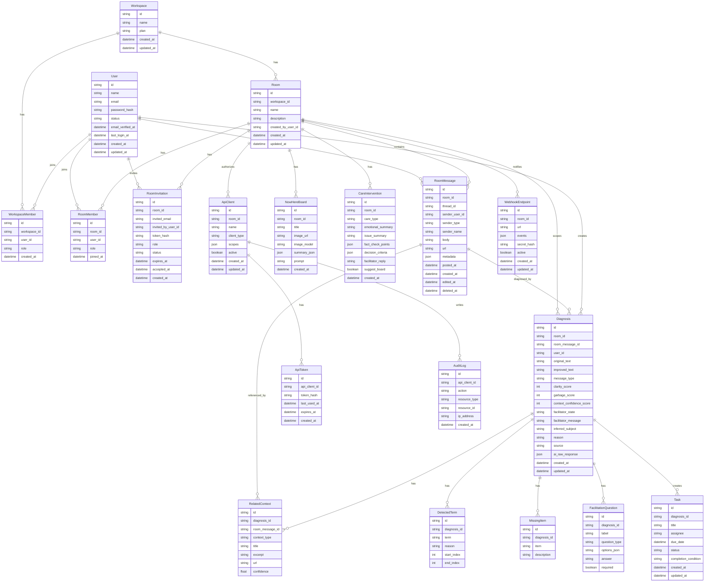

# ペラチャ 基本設計書

## 1. 文書概要

### 1.1 目的

本書は、`docs/design/要件定義.md` および製品概要イメージ `docs/design/image.png` をもとに、ペラチャの初期MVPを実装するための基本設計を定義する。

ペラチャは、送信者が箇条書きやメモ書きで入力した内容を、AIが過去文脈を踏まえて送信前に整形し、必要に応じて1枚画像の「ペライチ」として添付送信できるリアルタイムチャットツールである。

### 1.2 対象範囲

本書の主対象は、初期MVPである「AI整形・ペライチ生成付きリアルタイムチャット」とする。

MVPでは、Slackに近いルーム型リアルタイムチャットを土台とし、その上に送信前AI整形とペライチ画像生成を組み込む。AIは勝手に会話へ介入せず、ユーザーが「AI整形」または「ペライチ」を押したときだけ入力支援を行う。MVPから近接拡張にかけて扱う機能は以下である。

* ユーザー登録 / ログイン
* ルーム作成 / 招待
* ルーム内メッセージ投稿
* WebSocketによる新着メッセージ通知
* 送信前AI整形
* ルーム文脈を踏まえた改善文生成
* ペライチ画像生成
* 画像とテキストの同時送信
* ユーザー顔アイコン登録
* AIスタンプ生成 / 選択投稿
* タスク候補生成

Slack / Teams / Chatwork 連携、Chrome拡張、スレッド要約、組織分析は将来拡張として扱う。

### 1.3 参照資料

* 要件定義書: `docs/design/要件定義.md`
* 製品概要イメージ: `docs/design/image.png`

---

## 2. 製品コンセプト

### 2.1 製品名

Sapiens Chat

### 2.2 キャッチコピー

チャットを、人類語へ。

### 2.3 提供価値

Sapiens Chat は、送信者が気軽に書いた曖昧なチャット文を、AIファシリテーターが文脈から補い、受信者が解読しやすい業務メッセージへ変換する。

主な提供価値は以下である。

| 提供価値 | 内容 |
| --- | --- |
| あいまい語検出 | 「あれ」「これ」「なる早」など、業務上の解釈が分かれる表現を検出する |
| 文脈推定 | ルーム内の過去メッセージ、タスク、参照資料から「あれ」が指す候補を推定する |
| 関連履歴提示 | 該当しそうな過去のやり取りや資料リンクを提示する |
| 依頼の構造化 | 対象、内容、担当者、期限、完了条件を整理する |
| 動的フォーム | AIでも特定できない場合のみ、必要最小限の入力項目を生成する |
| 今ここボード | 脱線した会話の現在地を、1枚の画像ボードとして表示する |
| 論点ケア | 愚痴、持論ループ、論点ずれを受け止め、論点・事実・次アクションへ戻す |
| 要約・タスク化 | 会話や依頼を業務上のアクションへ変換する |
| 送信前チェック | 送信前に確認コストが発生しそうな箇所を警告する |

### 2.4 MVPにおける位置づけ

MVPでは、製品概要イメージにあるようなフルチャットUIを初期から前提にし、まずは単一ワークスペース、複数ルーム、参加者招待、リアルタイム投稿の基本体験を成立させる。

1. ユーザーが登録またはログインする
2. ユーザーが招待されたルームに参加する
3. ユーザーがルームへメッセージをPOSTする
4. APIがメッセージを保存し、同じルームの参加者へWebSocketで通知する
5. AIファシリテーターが投稿内容の曖昧さと不足情報を検出する
6. AIファシリテーターがルーム文脈から対象候補を推定する
7. 推定できた場合は、関連リンクと確認文を提示する
8. 推定できない場合のみ、必要最小限の動的フォームを提示する
9. AIファシリテーターが改善文、タスク候補、必要に応じた介入案を生成する

### 2.5 設計思想

Sapiens Chat の基本思想は、ユーザーに最初からフォーム入力を強制しないことである。

ユーザーは通常のチャットと同じように自由入力できる。AIファシリテーターは、入力文、ルーム内の過去メッセージ、関連タスク、参照資料から文脈を推定し、可能な限り人間に追加入力を求めずに業務文へ整える。

内部設計上、動的フォームは最終フォールバックであり、常設入力UIではない。

| 状態 | AIの振る舞い | UI |
| --- | --- | --- |
| 推理成功 | 「あれ」は〇〇の件ですか、と候補と根拠を提示する | 関連リンク、確認ボタン、改善文 |
| 部分推理 | 対象候補は提示し、足りない1から2項目だけ質問する | 追加質問チップまたは小入力欄 |
| 推理失敗 | 文脈から特定できないことを説明し、必要最小限のフォームを生成する | 動的フォーム |

開発チーム内では、動的フォームの表示を「AIファシリテーターが文脈推定に失敗した状態」と捉え、フォーム発生率を下げることを品質改善指標とする。

また、会話が愚痴、持論ループ、ツール紹介、論点ずれに流れた場合、AIファシリテーターは相手を否定せず、事実・論点・意思決定事項へ戻す。ユーザー向け名称は「論点ケア機能」とし、開発チーム内のコードネームとして「介護機能」を扱う。画面上では年齢、能力、人格を揶揄する表現を使わない。

### 2.6 BLAS無料提供モデル

Sapiens Chat は、チャットサービスを未導入の協力会社へ無料提供することで、業務インフラとして日常利用される接点を作る。

画面上では、広告メッセージを流すのではなく、`Powered by BLAS` 表示、今ここボードのフッター、管理画面の相談導線など、業務体験を邪魔しない形でBLASの存在を自然に提示する。

狙いは以下である。

* 協力会社との接点を増やす
* 日常利用の中でBLASの認知を継続する
* 業務課題が見えたタイミングで、業務改善・システム化の相談導線へつなげる
* 広告臭を出さず、信頼関係を壊さない

経営者説明用のペライチ画像は `docs/design/blas-free-chat-model.png` に保存する。

---

## 3. システム全体構成

### 3.1 論理構成



### 3.2 コンポーネント一覧

| コンポーネント | 役割 |
| --- | --- |
| Webフロントエンド | ルーム一覧、メッセージタイムライン、入力、診断結果表示、履歴表示、コピー操作を提供する |
| Python API | 認証、ルーム招待、メッセージ投稿、診断要求、履歴保存、履歴取得、タスク候補生成を処理する |
| WebSocket接続管理 | ルーム参加者の接続を管理し、メッセージ作成、AI介入、タスク更新などのイベントを配信する |
| ルールベース診断 | 曖昧語の簡易検出、基本スコア算出、AI呼び出し前の補助診断を行う |
| 文脈検索 | ルーム内の過去メッセージ、関連タスク、参照資料から候補を検索する |
| AIファシリテーター | 文脈推定、確認質問、動的フォーム要否判断、改善方針決定を行う |
| AI診断・整形 | メッセージ分類、不足情報抽出、改善文生成を行う |
| 動的フォーム生成 | AIでも特定できない不足項目に対して最小限の入力フォームを生成する |
| データベース | ルーム、メッセージ、診断履歴、改善文、スコア、タスク候補を保存する |

### 3.3 技術構成

| 領域 | 採用候補 | 備考 |
| --- | --- | --- |
| フロントエンド | Next.js / React / TypeScript | MVPではApp RouterまたはPages Routerのいずれかで統一する |
| スタイリング | Tailwind CSS | 製品イメージのネイビー、ティール、ホワイトを基調にする |
| バックエンド | Python / FastAPI | AI診断、履歴保存、タスク候補生成をAPIとして提供する |
| リアルタイム通信 | WebSocket | ルーム内のメッセージ作成、更新、AI介入、タスク更新、今ここボード生成を通知する |
| ORM / Migration | SQLAlchemy / Alembic | DB差し替えとマイグレーションを容易にする |
| DB | SQLite | ローカルMVPではSQLiteを第一候補とする |
| 文脈検索 | SQLite FTS / 将来はVector DB | MVPではキーワード検索と日時・ルーム絞り込みを優先する |
| AI連携 | OpenAI API | Python SDKを利用し、診断、分類、整形、タスク候補生成に利用する |
| 認証 | メールアドレス登録 / ログイン | MVPからユーザー登録を実装し、将来的にGoogle / Microsoft / SSOを追加する |

### 3.4 アプリケーション構成

MVPでは、フロントエンドとバックエンドを同一リポジトリ内で分離して管理する。

| ディレクトリ | 役割 |
| --- | --- |
| `frontend/` | Next.js / React による画面実装 |
| `backend/` | FastAPI によるAPI、診断処理、AI連携、DB操作 |
| `docs/` | 要件定義書、基本設計書などの設計資料 |

フロントエンドはREST APIとWebSocketでFastAPIへ接続する。ローカル開発では、Next.jsとFastAPIを別ポートで起動し、CORSおよびWebSocket接続元の許可設定で接続を制御する。

---

## 4. 機能構成

### 4.1 機能一覧

| 機能ID | 機能名 | MVP | 概要 |
| --- | --- | --- | --- |
| F-001 | ユーザー登録 / ログイン | 対象 | メールアドレスでユーザー登録し、ログインできる |
| F-002 | ルーム招待 | 対象 | 既存ユーザーまたは未登録ユーザーをルームへ招待できる |
| F-003 | ルーム参加管理 | 対象 | ルームごとの参加者と権限を管理する |
| F-004 | リアルタイムメッセージ | 対象 | ルームへメッセージを投稿し、参加者のタイムラインへリアルタイム反映する |
| F-005 | メッセージ履歴取得 | 対象 | ルーム入室時や再接続時に過去メッセージを取得する |
| F-006 | WebSocket通知 | 対象 | メッセージ作成、AI介入、タスク更新などをイベントとして配信する |
| F-007 | 曖昧語検出 | 対象 | 指示語、曖昧表現、期限不明表現を検出する |
| F-008 | ルーム文脈検索 | 一部対象 | 過去メッセージ、タスク、参照資料から関連候補を検索する |
| F-009 | AIファシリテーター判定 | 対象 | 推理成功、部分推理、推理失敗の状態を判定する |
| F-010 | 関連候補提示 | 一部対象 | 該当しそうな過去のやり取りや資料リンクを表示する |
| F-011 | メッセージ種別分類 | 対象 | 依頼、質問、報告、共有などに分類する |
| F-012 | 不足情報チェック | 対象 | 対象、内容、期限、担当者、完了条件などの不足を検出する |
| F-013 | 動的フォーム生成 | 対象 | AIでも不明な場合のみ、必要最小限の入力項目を生成する |
| F-014 | スコア算出 | 対象 | 明確度、ゴミ度、文脈推定信頼度を0から100で算出する |
| F-015 | AI整形 | 対象 | 伝わる業務文へ改善する |
| F-016 | 診断結果表示 | 対象 | 検出結果、推定根拠、改善文を表示する |
| F-017 | コピー | 対象 | 改善文をクリップボードへコピーする |
| F-018 | 履歴保存 | 対象 | 診断結果を保存する |
| F-019 | 履歴一覧 | 対象 | 過去の診断結果を一覧表示する |
| F-020 | タスク候補生成 | 一部対象 | 依頼文からタスク候補を抽出する |
| F-021 | 今ここボード生成 | 将来 | 重要な論点、決定事項、未決事項、次アクションを1枚画像にまとめる |
| F-022 | 論点ケア | 将来 | 愚痴、持論ループ、論点ずれを整理し、業務上の論点へ戻す |
| F-023 | タスク一覧 | 将来 | タスク状態を管理する |
| F-024 | スレッド要約 | 将来 | 長い会話から決定事項や次アクションを抽出する |
| F-025 | 外部チャット連携 | 将来 | Slack / Teams / Chatwork と連携する |
| F-026 | 送信前チェック | 将来 | 外部チャット上で送信前に警告する |
| F-027 | 外部エージェントREST API | 将来 | Codexなどの外部ツールがメッセージ取得、投稿、タスク作成を行う |
| F-028 | Webhook通知 | 将来 | メッセージ作成、タスク作成、診断完了などを外部ツールへ通知する |

### 4.2 MVP機能境界

MVPで作るものは、ルーム型リアルタイムチャットの最小構成と、AIファシリテーターによる診断・文脈推定・整形のコア体験である。

ルーム文脈検索は、MVPではSapiens Chat内に投稿されたルームメッセージと診断履歴を主対象にする。外部チャット全体の履歴取り込みは将来拡張とする。

対象外とするものは以下である。

* 複数ユーザー間DM
* 本格的な権限管理
* ファイル添付
* 外部チャットへの自動投稿
* 組織管理
* 高度なセマンティック検索
* 複数サーバー構成でのWebSocket水平分散

---

## 5. 画面設計

### 5.1 共通レイアウト

製品概要イメージを踏まえ、将来的にはSlackに近い左サイドナビゲーションを持つ業務チャット型レイアウトとする。

LINEのような1対1メッセンジャー風UIは、短文・反射的な投稿を促しやすいため主軸にしない。Sapiens Chat では、チャンネル、スレッド、履歴、タスク、今ここボードが並ぶ「業務の作業場」として設計する。

| 領域 | 内容 |
| --- | --- |
| 左サイドナビ | ワークスペース、チャンネル、DM、タスク、今ここボード、検索、設定 |
| チャンネルヘッダー | チャンネル名、説明、参加者、検索、通知 |
| メインタイムライン | メッセージ、AIファシリテーター介入、診断結果 |
| 右サイドペイン | スレッド詳細、関連候補、タスク候補、今ここボード |
| メッセージ入力エリア | 入力欄、送信前チェック、AI整形、添付導線 |

MVPでは、左サイドナビは簡易表示または省略可能とする。ただし、将来拡張を見越してチャンネル、スレッド、右サイドペインを追加しやすい構造にする。

### 5.2 ユーザー登録 / ログイン画面

#### 目的

ユーザーがSapiens Chatに登録し、参加可能なワークスペースとルームへアクセスできるようにする。

#### 表示項目

| 項目 | 内容 |
| --- | --- |
| ユーザー登録フォーム | 表示名、メールアドレス、パスワード |
| ログインフォーム | メールアドレス、パスワード |
| 招待リンク状態 | 招待されたルーム名、招待者、参加ボタン |
| ワークスペース作成 | 初回ユーザー向けにワークスペース名を入力 |

### 5.3 ルーム招待画面

#### 目的

ルームのowner / adminが、ユーザーをメールアドレスで招待できるようにする。

#### 表示項目

| 項目 | 内容 |
| --- | --- |
| 招待メール入力 | 招待先メールアドレス |
| 権限選択 | admin / member / guest |
| 招待中一覧 | 招待先、状態、有効期限、再送、取り消し |
| 参加メンバー一覧 | 表示名、メールアドレス、権限 |

### 5.4 ルーム / チャット画面

#### 目的

ユーザーがルーム内でメッセージを投稿し、他参加者の投稿、AIファシリテーターによる文脈推定、診断結果、改善文をリアルタイムに確認する。

#### 表示項目

| 項目 | 内容 |
| --- | --- |
| 製品名 | Sapiens Chat |
| キャッチコピー | チャットを、人類語へ。 |
| ルームヘッダー | ルーム名、説明、参加者、招待導線 |
| メッセージタイムライン | ユーザー投稿、外部エージェント投稿、AIファシリテーター介入を時系列で表示する |
| メッセージ入力欄 | 複数行テキスト入力 |
| 送信ボタン | ルームへメッセージを投稿する |
| 接続状態 | WebSocket接続中、再接続中、オフラインを表示する |
| サンプル入力ボタン | 曖昧な例文を入力欄へ反映する |
| 診断ボタン | 診断処理を実行する |
| ルーム選択 | 文脈検索に利用するルームを選択する |
| Before表示 | 元メッセージを表示する |
| AIファシリテーター発言 | 推定結果、確認質問、フォーム提示理由を表示する |
| 関連候補 | 該当しそうな過去メッセージ、タスク、資料リンクを表示する |
| 警告表示 | AIが検出した問題を表示する |
| AIフィルター表示 | 診断中または整形プロセスを示す |
| 動的フォーム | AIでも不明な場合のみ、不足項目の入力欄を表示する |
| After表示 | 改善後メッセージを表示する |
| コピーするボタン | 改善後メッセージをコピーする |
| 保存状態 / 保存ボタン | 自動保存済み状態を表示する。手動保存方式に変更する場合は保存ボタンとして扱う |

#### 操作

| 操作 | 処理 |
| --- | --- |
| メッセージ入力 | 文字数、空入力をフロントエンドで検証する |
| メッセージ送信 | `/api/rooms/{room_id}/messages` にPOSTし、保存成功後にWebSocket通知でタイムラインへ反映する |
| WebSocket受信 | `message.created`、`facilitator.intervened` などのイベントを受信し、画面状態を更新する |
| 再接続 | WebSocket切断時に再接続し、REST APIで未取得メッセージを補完する |
| 診断ボタン押下 | `/api/diagnoses` にPOSTする |
| 関連候補選択 | 選択した候補を対象文脈として診断に反映する |
| 追加質問回答 | 不足情報を回答し、改善文を再生成する |
| 動的フォーム回答 | 必須項目を入力し、改善文を再生成する |
| サンプル入力 | 例文を入力欄へ反映する |
| 改善文コピー | Clipboard APIでコピーする |
| 保存 | 手動保存方式の場合、診断済みデータを保存する |

#### 画面状態

| 状態 | 表示 |
| --- | --- |
| 初期状態 | タイムライン、入力欄、サンプル入力、診断ボタンを表示する |
| 入力中 | 診断ボタンを有効化する |
| 送信中 | 送信ボタンを一時的に無効化し、投稿中状態を表示する |
| WebSocket接続中 | 新着メッセージをリアルタイムに反映する |
| WebSocket切断中 | 再接続中表示を出し、復帰後に履歴差分を取得する |
| 診断中 | 文脈検索中、AI推理中、整形中のローディング表示、ボタン無効化 |
| 推理成功 | 関連候補、推定根拠、改善文を表示する |
| 部分推理 | 関連候補、追加質問、仮の改善文を表示する |
| 推理失敗 | 動的フォーム、フォーム提示理由を表示する |
| 診断成功 | スコア、検出語、不足情報、推定根拠、改善文を表示する |
| 診断失敗 | エラーメッセージと再試行導線を表示する |

### 5.5 診断結果画面 / 結果パネル

MVPではホーム画面内の結果パネルとして実装してよい。将来的に詳細画面へ分離する。

#### 表示項目

| 項目 | 内容 |
| --- | --- |
| メッセージ種別 | 依頼、質問、報告、共有など |
| 明確度スコア | 0から100の整数 |
| ゴミ度スコア | 0から100の整数 |
| 文脈推定信頼度 | AIが対象を推定できている度合い |
| ファシリ状態 | 推理成功、部分推理、推理失敗 |
| スコア理由 | スコアの主な根拠 |
| 推定対象 | 「あれ」「この件」などが指すと推定した対象 |
| 関連候補 | 推定根拠となる過去メッセージ、タスク、資料 |
| 検出された曖昧語 | 単語と検出理由 |
| 不足情報 | 対象、期限、完了条件など |
| 動的フォーム項目 | 推理失敗時に回答が必要な項目 |
| 改善ポイント | 改善時に補った観点 |
| 改善文 | コピー可能な業務文 |
| タスク候補 | 依頼文の場合に表示する |

#### 表示ルール

| 条件 | 表示 |
| --- | --- |
| 明確度80以上 | 通常表示。送信可能な状態として扱う |
| 明確度50から79 | 注意表示。改善文の採用を促す |
| 明確度49以下 | 警告表示。不足情報の入力または改善文採用を促す |
| ゴミ度70以上 | 強めの警告表示にする |
| 文脈推定信頼度70以上 | 推定候補を採用前提で表示し、確認ボタンを出す |
| 文脈推定信頼度40から69 | 候補を複数表示し、選択または追加質問を促す |
| 文脈推定信頼度39以下 | 動的フォームを表示する |

### 5.6 履歴画面

#### 目的

過去の診断結果を確認し、改善文を再利用できるようにする。

#### 表示項目

| 項目 | 内容 |
| --- | --- |
| 診断日時 | 作成日時 |
| 元メッセージ | 入力文の先頭部分 |
| 改善後メッセージ | 改善文の先頭部分 |
| 種別 | メッセージ種別 |
| 明確度 | スコア |
| ゴミ度 | スコア |
| 詳細ボタン | 診断詳細を開く |
| コピーボタン | 改善文をコピーする |

#### 操作

| 操作 | 処理 |
| --- | --- |
| 履歴表示 | `/api/diagnoses` にGETする |
| 詳細表示 | `/api/diagnoses/{id}` にGETする |
| コピー | 改善文をクリップボードへコピーする |

### 5.7 タスク画面

MVPではタスク候補表示までを優先し、タスク管理画面は簡易実装または将来拡張とする。

#### 表示項目

| 項目 | 内容 |
| --- | --- |
| タスク名 | AIが生成した短い名称 |
| 担当者 | メッセージから抽出。未特定の場合は空 |
| 期限 | メッセージから抽出。未特定の場合は空 |
| 状態 | 未着手、進行中、確認待ち、完了、保留 |
| 完了条件 | 完了判断に必要な条件 |
| 元メッセージ | 紐づく診断結果 |

### 5.8 設定画面

MVPでは任意。将来的に以下を設定できるようにする。

| 項目 | 内容 |
| --- | --- |
| AIモデル | 利用するAIモデル |
| 曖昧語辞書 | 組織独自の曖昧語 |
| スコア閾値 | 警告表示の基準 |
| 外部連携 | Slack / Teams / Chatwork など |
| 今ここボード | 自動生成条件、画像生成モデル、保存設定 |
| 論点ケア | 介入頻度、口調、対象パターン |

### 5.9 今ここボード画面

#### 目的

会話が長くなったり脱線したりしたときに、現在重要な論点を1枚の画像ボードとして表示し、参加者を同じ理解へ戻す。

#### 表示項目

| 項目 | 内容 |
| --- | --- |
| ボード画像 | 画像生成モデルで生成した1枚画像 |
| タイトル | 会話の現在地を表す短い見出し |
| 重要論点 | 今見るべき論点 |
| 決定事項 | すでに決まったこと |
| 未決事項 | まだ決まっていないこと |
| 次アクション | 誰が何をいつまでに行うか |
| 生成元 | 対象ルーム、対象メッセージ範囲 |
| 再生成ボタン | 内容を更新して再生成する |

#### 生成タイミング

| 条件 | 動作 |
| --- | --- |
| ユーザーが明示的に生成 | 現在のスレッドまたはルーム範囲から生成する |
| 会話が長文化 | 一定件数以上のやり取りが続いた場合に提案する |
| 脱線検出 | 論点ずれ、愚痴、持論ループが続いた場合に提案する |
| 決定事項発生 | 決定事項と次アクションが抽出できた場合に提案する |

### 5.10 論点ケア画面

#### 目的

愚痴、持論ループ、論点ずれ、技術議論に見えるツール紹介などをAIファシリテーターが受け止め、業務上の論点へ戻す。

#### 対象パターン

| パターン | 例 | 介入方針 |
| --- | --- | --- |
| 愚痴の継続 | 「なぜ自分の案が採用されないのか」が繰り返される | 感情を受け止めつつ、採用判断の論点へ戻す |
| 持論ループ | 同じ主張が根拠追加なしに繰り返される | 既出論点として整理し、未回答の論点を提示する |
| 論点ずれ | 技術選定の話がツール紹介にすり替わる | 技術、ツール、運用コストを分離する |
| 費用対効果不明 | 乗り換えメリットが説明されない | メリット、移行コスト、周知コストを比較表にする |

#### 返信方針

AIファシリテーターは相手を否定せず、以下の順で返す。

1. 主張を短く要約する
2. 感情または困りごとを受け止める
3. 事実、論点、判断基準に分解する
4. 足りない情報を質問する
5. 必要に応じて今ここボード生成を提案する

---

## 6. UI設計方針

### 6.1 トーン

Slackに近い業務チャットの印象を重視し、LINEのような軽い1対1メッセンジャーの印象は避ける。

以下の印象を重視する。

* 業務で使える信頼感
* チャンネル、スレッド、タスクが見える作業場感
* 会話の流れと業務文脈を同時に追える情報密度
* 診断結果が一目で分かる明快さ
* 送信者を責めず、改善を支援する軽さ
* AIファシリテーターが会話を邪魔せず、必要なときだけ介入する控えめさ
* フォームが出た場合も、ユーザーに敗北感を与えず、丁寧に補足を依頼する安心感
* 「Before / After」の変化が分かる視覚構成

### 6.2 UI参照方針

| 方針 | 内容 |
| --- | --- |
| 参考にする | Slackのようなワークスペース、チャンネル、スレッド、右ペイン構成 |
| 避ける | LINEのような大きな吹き出し中心、短文会話中心、個人チャット中心の構成 |
| 理由 | 反射的な短文投稿ではなく、業務文脈、判断材料、次アクションを残すため |
| メッセージ表示 | 吹き出しよりも、投稿者、時刻、本文、リアクション、スレッド導線が見えるリスト型 |
| AI表示 | 通常メッセージと混ぜすぎず、ファシリテーター介入として区別して表示する |

### 6.3 カラーパレット

| 用途 | 色味 |
| --- | --- |
| ブランド主色 | 濃紺 |
| アクセント | ティール / シアン |
| 背景 | ホワイト / ごく薄いグレー |
| 警告 | 淡い赤背景と赤アイコン |
| 成功 | ティールまたはグリーン |

### 6.4 主なUIコンポーネント

| コンポーネント | 用途 |
| --- | --- |
| ChatTimeline | ルーム内メッセージとAI介入を時系列表示する |
| MessageComposer | メッセージ入力、送信、診断実行の操作領域 |
| ConnectionStatus | WebSocket接続状態、再接続中、オフラインを表示する |
| Textarea | メッセージ入力 |
| Button | 診断、コピー、保存、サンプル入力 |
| ScoreBadge | 明確度 / ゴミ度表示 |
| AlertPanel | 曖昧語、不足情報の警告表示 |
| FacilitatorPanel | AIファシリテーターの推定、確認質問、フォーム提示理由 |
| RelatedContextList | 関連する過去メッセージ、タスク、資料候補 |
| DynamicForm | 推理失敗時の必要最小限フォーム |
| NowHereBoard | 会話の現在地を示す1枚画像ボード |
| CareInterventionPanel | 論点ケアの検出理由、整理結果、返信案 |
| BeforeAfterPanel | 元文と改善文の比較 |
| ResultCard | 診断結果のまとまり |
| HistoryList | 診断履歴一覧 |
| TaskCandidateList | タスク候補表示 |

---

## 7. 処理設計

### 7.0 リアルタイムチャット処理の基本方針

Sapiens Chat では、メッセージの正本はREST APIで保存し、WebSocketは保存済みイベントの通知と画面同期に利用する。

基本方針は以下である。

| 項目 | 方針 |
| --- | --- |
| メッセージ作成 | `POST /api/rooms/{room_id}/messages` で受け付ける |
| 永続化 | APIが `RoomMessage` としてDBへ保存する |
| リアルタイム反映 | DBコミット後に、同じルームのWebSocket購読者へ `message.created` を配信する |
| 再接続 | WebSocket再接続後、REST APIで未取得メッセージを取得して補完する |
| 正本 | REST APIとDBを正本とし、WebSocketイベントは通知として扱う |
| スケール方針 | ローカルMVPは単一FastAPIプロセス内配信で動作し、`REDIS_URL` 設定時はRedis Pub/Subで複数インスタンス配信を行う |

#### 投稿・通知フロー



#### WebSocketイベント

| イベント | 用途 |
| --- | --- |
| `message.created` | メッセージが作成された |
| `message.updated` | メッセージが編集された |
| `message.deleted` | メッセージが削除または非表示化された |
| `diagnosis.completed` | 投稿メッセージに対するAI診断が完了した |
| `facilitator.intervened` | AIファシリテーターが確認質問、関連候補、論点整理を投稿した |
| `task.created` | タスク候補またはタスクが作成された |
| `task.updated` | タスク状態が更新された |
| `board.created` | 今ここボードが生成された |
| `typing.started` | 入力中状態が開始された |
| `typing.stopped` | 入力中状態が終了した |

#### `message.created` Payload例

```json
{
  "event": "message.created",
  "room_id": "room_001",
  "data": {
    "id": "msg_101",
    "sender_type": "user",
    "sender_name": "山田 太郎",
    "body": "確認お願いします",
    "thread_id": null,
    "created_at": "2026-06-13T00:00:00.000Z"
  }
}
```

AIファシリテーター、外部エージェント、Webhook通知も同じイベント基盤を利用する。たとえばCodexが外部APIでメッセージをPOSTした場合も、保存後に `message.created` をルームへ配信する。

投稿者本人の画面は、REST APIのレスポンスとWebSocketイベントの両方を受け取る可能性があるため、フロントエンドは `message.id` で重複排除する。

### 7.1 診断処理フロー



### 7.2 AIファシリテーション処理

AIファシリテーターは、自由入力されたメッセージに対して以下の順序で介入する。

1. 曖昧語、不足情報、メッセージ種別を診断する
2. ルーム文脈から関連候補を検索する
3. 関連候補が入力文の曖昧語を補えるか判定する
4. 推理状態を `inferred`, `needs_confirmation`, `unknown` のいずれかに分類する
5. `inferred` の場合は推定根拠と改善文を提示する
6. `needs_confirmation` の場合は候補選択または短い追加質問を提示する
7. `unknown` の場合のみ動的フォームを生成する

推理状態の定義は以下である。

| 状態 | 条件 | UI |
| --- | --- | --- |
| `inferred` | 文脈推定信頼度が高く、候補が1つに絞れる | 推定対象、根拠リンク、改善文 |
| `needs_confirmation` | 複数候補がある、または一部情報だけ不足している | 候補選択、追加質問、仮改善文 |
| `unknown` | 文脈から対象や目的を特定できない | 動的フォーム |

### 7.3 ルールベース診断

AI診断の前処理として、以下をルールで検出する。

| 検出種別 | 例 |
| --- | --- |
| 指示語 | あれ、それ、これ、この資料、前のやつ |
| 期限曖昧 | なる早、今日中、今週中、手が空いたら |
| 依頼曖昧 | いい感じに、適当に、見ておいて、確認お願いします |
| 対象曖昧 | 例の件、さっきの話、この前の資料 |

ルール診断結果は、AIへの入力コンテキストとして渡し、AI出力の補助にも利用する。

### 7.4 スコア算出

明確度、ゴミ度、文脈推定信頼度は、AI判定を主としつつ、ルールベース診断と文脈検索結果で補正する。

#### 明確度

業務文として必要な情報が揃っている度合いを表す。0が最も不明確、100が最も明確。

主な評価軸は以下である。

* 対象が明確である
* 依頼内容または質問内容が明確である
* 期限が明確である
* 担当者が明確である
* 完了条件が明確である
* 参照資料が特定できる

#### ゴミ度

受信者に解読、確認、再質問の負担を発生させる度合いを表す。0が最も問題なし、100が最も問題あり。

基本的には `100 - 明確度` を基準とし、曖昧語数や不足項目数に応じて補正する。

#### 文脈推定信頼度

AIファシリテーターが、曖昧語の指す対象をどれだけ確信しているかを表す。0が推定不能、100が高信頼。

主な評価軸は以下である。

* 関連候補が1つに絞れている
* 入力文と候補のキーワード、担当者、期限、資料名が一致している
* 候補が直近の会話または未完了タスクに紐づいている
* ユーザーの宛先やルームと候補が一致している

### 7.5 AI整形処理

AI整形では、元メッセージの意図を変えずに、業務で使える文面へ整える。

整形時の方針は以下である。

* 不明な固有情報は勝手に断定しない
* 不足情報は `〇〇` などのプレースホルダー、または確認質問として表現する
* 依頼文では、対象、作業内容、期限、完了条件を明示する
* 質問文では、質問対象と回答してほしい形式を明示する
* 報告文では、結論、影響、次アクションを明示する
* 業務上失礼にならない表現にする

### 7.6 動的フォーム生成処理

動的フォームは、AIファシリテーターが文脈から対象や目的を特定できない場合のみ生成する。

フォーム生成時の方針は以下である。

* 不足情報のすべてを聞くのではなく、改善文生成に必要な最小項目だけを聞く
* 1回のフォームで必須項目は原則3から5個までに抑える
* 選択肢で答えられる項目は選択式にする
* 自由記述が必要な項目だけテキスト入力にする
* フォーム回答後は、ユーザーが書いた文章ではなく、業務文として整形されたメッセージを提示する

フォーム項目例は以下である。

| 項目 | 種別 | 目的 |
| --- | --- | --- |
| 対象 | text | 「あれ」「この件」が何を指すかを補う |
| 相手 | text | 誰に確認または依頼するかを補う |
| 期限 | datetime / text | いつまでの件かを補う |
| 期待する回答 | select | 進捗、完了報告、資料共有、判断などを選ぶ |
| 完了条件 | text | 相手が何を返せば完了かを補う |

### 7.7 履歴保存処理

診断成功時に、元メッセージ、診断結果、改善文、スコアを保存する。

保存タイミングは以下のいずれかとする。

| 方式 | 内容 | MVP方針 |
| --- | --- | --- |
| 自動保存 | 診断成功時に保存する | 採用 |
| 手動保存 | ユーザーが保存ボタンを押した場合のみ保存する | 将来検討 |

MVPでは履歴機能の分かりやすさを優先し、診断成功時に自動保存する。

### 7.8 タスク候補生成処理

メッセージ種別が `依頼` または `判断依頼` の場合、タスク候補を生成する。

生成対象は以下である。

| 項目 | 抽出方針 |
| --- | --- |
| タスク名 | 依頼内容から短く生成する |
| 担当者 | 宛先や文中の担当者から抽出する |
| 期限 | 日付、曜日、相対表現から抽出する |
| 完了条件 | 完了時に返すべき成果物や返信内容を抽出する |
| 優先度 | 明示がある場合のみ抽出する |

### 7.9 今ここボード生成処理

今ここボードは、長くなった会話や脱線した会話から、現在重要な情報だけを抽出し、1枚画像として表示する。

#### 生成フロー



#### 画像生成方針

* 画像生成モデルは、実装時点で利用可能なモデルを公式仕様に基づいて選定する
* 実装既定値は `gpt-image-2` とする
* 文字、見出し、図解要素も画像生成モデル側で描画する
* 生成前にAI要約でボード構成JSONを作成し、画像生成プロンプトへ渡す
* 重要情報の誤記を避けるため、生成画像とは別に構造化テキストも保存する

#### ボード構成

| 項目 | 内容 |
| --- | --- |
| title | 会話の現在地 |
| key_points | 重要論点 |
| decisions | 決定事項 |
| open_questions | 未決事項 |
| next_actions | 次アクション |
| risks | 放置すると問題になる点 |
| source_message_ids | 生成元メッセージ |

### 7.10 論点ケア処理

論点ケアは、会話が愚痴、持論ループ、論点ずれに流れた場合に、AIファシリテーターが相手を否定せず、業務上の論点へ戻す処理である。

#### 検出対象

| 検出種別 | 判定例 |
| --- | --- |
| 愚痴継続 | 同じ不満が複数回投稿され、次アクションが出ていない |
| 持論ループ | 同じ主張が根拠追加なしに繰り返される |
| 論点ずれ | 技術、ツール、運用、感情の論点が混線している |
| 費用対効果不足 | メリット、移行コスト、周知コストが比較されていない |
| 採用理由不明 | なぜ採用されないかの判断基準が整理されていない |

#### 介入出力

| 項目 | 内容 |
| --- | --- |
| care_type | 愚痴継続、持論ループ、論点ずれなど |
| emotional_summary | 相手の困りごとや不満の要約 |
| issue_summary | 業務上の論点 |
| fact_check_points | 確認すべき事実 |
| decision_criteria | 判断基準 |
| facilitator_reply | AIファシリテーターの返信案 |
| suggest_board | 今ここボード生成を提案するか |

#### 返信例

> 伝えたいことは「Discordへ移行したいが、提案が技術として評価されていない」という点だと理解しました。  
> ただし、今回の判断論点は技術そのものではなく、既存のLINE WORKSから移行する業務メリット、周知コスト、運用負荷です。  
> 比較するなら、1. 利用者メリット、2. 移行コスト、3. 既存運用との差分、4. 導入後の責任者を整理すると判断しやすくなります。

---

## 8. API設計

### 8.0 認証・ルーム招待API

MVPからユーザー登録とログインを実装する。画面利用者の認証は、HttpOnly Cookieによるセッションを基本とする。外部エージェント向けAPIは、別途Bearerトークンで認証する。

#### POST /api/auth/register

ユーザーを新規登録する。

```json
{
  "name": "山田 太郎",
  "email": "taro@example.com",
  "password": "********"
}
```

登録後、初回ユーザーの場合はワークスペースを作成できる。招待リンク経由の場合は、登録後に対象ルームへの参加処理へ進む。

#### POST /api/auth/login

メールアドレスとパスワードでログインする。

```json
{
  "email": "taro@example.com",
  "password": "********"
}
```

成功時は、HttpOnly Cookieにセッションを設定する。

#### GET /api/auth/me

ログイン中ユーザー、所属ワークスペース、参加ルームを取得する。

#### POST /api/rooms

ルームを作成する。作成者は `owner` として `RoomMember` に登録する。

```json
{
  "workspace_id": "ws_001",
  "name": "提案資料の更新",
  "description": "経営者向けシステム提案資料の作業ルーム"
}
```

#### POST /api/rooms/{room_id}/invitations

ルームへユーザーを招待する。

```json
{
  "email": "partner@example.com",
  "role": "member"
}
```

招待先が未登録の場合、招待メールまたは招待リンクからユーザー登録へ誘導する。登録済みの場合は、招待承諾のみで参加できる。

#### POST /api/invitations/{token}/accept

招待を承諾し、対象ルームの `RoomMember` として登録する。

```json
{
  "user_id": "user_001"
}
```

#### 権限方針

| 操作 | 必要権限 |
| --- | --- |
| ルーム閲覧 | RoomMemberであること |
| メッセージ投稿 | RoomMemberであること |
| ルーム招待 | owner / admin |
| ルーム設定変更 | owner / admin |
| APIトークン発行 | owner / admin |

### 8.1 ルームメッセージAPI / WebSocket

画面上のリアルタイムチャットは、REST APIでメッセージを作成し、WebSocketでルーム参加者へ通知する。

#### GET /api/rooms/{room_id}/messages

ルーム入室時、再接続時、履歴スクロール時にメッセージ一覧を取得する。

##### Query

| 項目 | 内容 |
| --- | --- |
| limit | 取得件数。デフォルト50 |
| cursor | ページング用カーソル |
| since | 指定日時以降のメッセージ |

##### Response

```json
{
  "items": [
    {
      "id": "msg_001",
      "room_id": "room_001",
      "sender_type": "user",
      "sender_name": "山田 太郎",
      "body": "この資料、いい感じに直してください。なる早で。",
      "thread_id": null,
      "created_at": "2026-06-13T00:00:00.000Z"
    }
  ],
  "next_cursor": null
}
```

#### POST /api/rooms/{room_id}/messages

画面利用者がルームへメッセージを投稿する。APIは保存完了後、同じルームへ `message.created` をWebSocket配信する。

##### Request

```json
{
  "body": "この資料、いい感じに直してください。なる早で。",
  "thread_id": null,
  "diagnose_after_post": true
}
```

##### Response

```json
{
  "id": "msg_101",
  "room_id": "room_001",
  "sender_type": "user",
  "sender_name": "山田 太郎",
  "body": "この資料、いい感じに直してください。なる早で。",
  "thread_id": null,
  "created_at": "2026-06-13T00:00:00.000Z"
}
```

##### 処理順

1. セッションを確認する
2. `RoomMember` であることを確認する
3. 入力値を検証する
4. `RoomMessage` として保存する
5. DBコミット後に `message.created` を配信する
6. `diagnose_after_post` が有効な場合、AI診断を非同期または後続処理で開始する
7. 診断完了後に `diagnosis.completed` または `facilitator.intervened` を配信する

#### WebSocket /ws/rooms/{room_id}

ルーム単位のイベント購読に利用する。画面利用ではHttpOnly Cookieのセッションで認証し、接続時に `RoomMember` を確認する。

本番運用では、アクセストークンをURLクエリに載せない。外部エージェントのリアルタイム購読が必要になった場合は、短命トークンまたは専用WebSocket認証を別途設計する。

##### Server Event Payload

```json
{
  "event": "message.created",
  "room_id": "room_001",
  "data": {
    "id": "msg_101",
    "sender_type": "user",
    "sender_name": "山田 太郎",
    "body": "この資料、いい感じに直してください。なる早で。",
    "thread_id": null,
    "created_at": "2026-06-13T00:00:00.000Z"
  }
}
```

##### Client Event Payload

クライアントから送信するイベントは最小限とし、MVPでは接続維持と入力中表示に限定する。

```json
{
  "event": "typing.started",
  "room_id": "room_001"
}
```

### 8.2 POST /api/diagnoses

メッセージを診断し、結果を保存して返却する。

#### Request

```json
{
  "text": "この資料、いい感じに直してください。なる早で。",
  "source": "manual",
  "room_id": "room_001",
  "room_message_id": "msg_101",
  "selected_context_id": null,
  "form_answers": null
}
```

#### Response

```json
{
  "id": "diag_001",
  "room_message_id": "msg_101",
  "original_text": "この資料、いい感じに直してください。なる早で。",
  "message_type": "依頼",
  "clarity_score": 35,
  "garbage_score": 65,
  "context_confidence_score": 42,
  "facilitator_state": "needs_confirmation",
  "facilitator_message": "「この資料」は、直近の会話にある提案資料のことかもしれません。対象が合っているか確認してください。",
  "inferred_subject": "〇〇案件の提案資料",
  "related_contexts": [
    {
      "id": "ctx_001",
      "type": "message",
      "title": "#提案資料の更新",
      "excerpt": "3ページ目の金額表を最新版に差し替える必要があります。",
      "url": "/rooms/room_001/messages/msg_123",
      "confidence": 0.72
    }
  ],
  "detected_terms": [
    {
      "term": "この資料",
      "reason": "対象資料が特定できません"
    },
    {
      "term": "いい感じに",
      "reason": "修正内容が不明確です"
    },
    {
      "term": "なる早",
      "reason": "期限が具体的ではありません"
    }
  ],
  "missing_items": [
    {
      "item": "対象",
      "description": "どの資料を指しているかが不明です"
    },
    {
      "item": "修正内容",
      "description": "どの観点で修正すべきかが不明です"
    },
    {
      "item": "期限",
      "description": "いつまでに対応すべきかが不明です"
    },
    {
      "item": "完了条件",
      "description": "完了後に何を返せばよいかが不明です"
    }
  ],
  "reason": "対象資料、修正内容、期限、完了条件が不足しているため、受信者に確認コストが発生します。",
  "improved_text": "添付の〇〇資料について、以下の観点で修正をお願いします。\n\n1. 修正対象を明確にする\n2. 反映してほしい内容を具体化する\n3. 完了後、このスレッドに修正版を共有する\n\n期限は〇月〇日〇時です。",
  "clarification_questions": [
    {
      "id": "q_001",
      "label": "対象資料はこの候補で合っていますか？",
      "type": "single_select",
      "options": [
        {
          "label": "〇〇案件の提案資料",
          "value": "ctx_001"
        },
        {
          "label": "別の資料",
          "value": "other"
        }
      ],
      "required": true
    }
  ],
  "dynamic_form": null,
  "task_candidates": [
    {
      "title": "資料修正",
      "assignee": null,
      "due_date": null,
      "completion_condition": "修正版をスレッドに共有する"
    }
  ],
  "created_at": "2026-06-13T00:00:00.000Z"
}
```

#### バリデーション

| 項目 | ルール |
| --- | --- |
| text | 必須 |
| text | 1文字以上 |
| text | MVPでは最大5000文字 |
| source | `manual`, `sample`, `external` のいずれか |
| room_id | 任意。文脈検索対象のルームID |
| room_message_id | 任意。診断対象の投稿済みメッセージID |
| selected_context_id | 任意。ユーザーが採用した関連候補ID |
| form_answers | 任意。動的フォームへの回答 |

### 8.3 POST /api/diagnoses/{id}/answers

AIファシリテーターの追加質問または動的フォームへの回答を送信し、改善文を再生成する。

#### Request

```json
{
  "selected_context_id": "ctx_001",
  "answers": [
    {
      "question_id": "q_001",
      "value": "ctx_001"
    }
  ]
}
```

#### Response

`POST /api/diagnoses` と同じ形式で、更新後の診断結果を返却する。

### 8.4 GET /api/diagnoses

診断履歴一覧を取得する。

#### Query

| 項目 | 内容 |
| --- | --- |
| limit | 取得件数。デフォルト20 |
| cursor | ページング用カーソル |
| message_type | 任意の種別フィルタ |

#### Response

```json
{
  "items": [
    {
      "id": "diag_001",
      "original_text": "この資料、いい感じに直してください。なる早で。",
      "improved_text": "添付の〇〇資料について...",
      "message_type": "依頼",
      "clarity_score": 35,
      "garbage_score": 65,
      "created_at": "2026-06-13T00:00:00.000Z"
    }
  ],
  "next_cursor": null
}
```

### 8.5 GET /api/diagnoses/{id}

診断履歴の詳細を取得する。

### 8.6 GET /api/rooms/{id}/contexts

ルーム内の関連文脈候補を取得する。MVPでは診断API内部から利用するため、画面から直接呼ぶかは任意とする。

#### Query

| 項目 | 内容 |
| --- | --- |
| q | 検索クエリ |
| limit | 取得件数。デフォルト5 |

### 8.7 POST /api/tasks

タスク候補をタスクとして保存する。MVPでは任意実装とする。

#### Request

```json
{
  "diagnosis_id": "diag_001",
  "title": "資料修正",
  "assignee": "未設定",
  "due_date": null,
  "completion_condition": "修正版をスレッドに共有する"
}
```

### 8.8 POST /api/boards

今ここボードを生成する。将来実装対象とする。

#### Request

```json
{
  "room_id": "room_001",
  "message_ids": ["msg_001", "msg_002", "msg_003"],
  "trigger": "manual",
  "image_model": "gpt-image-2"
}
```

#### Response

```json
{
  "id": "board_001",
  "room_id": "room_001",
  "title": "LINE WORKSからDiscord移行提案の現在地",
  "summary_json": {
    "key_points": ["移行メリットが未整理", "周知コストが判断材料になっている"],
    "decisions": [],
    "open_questions": ["誰にどの業務メリットがあるか", "移行後の運用責任者は誰か"],
    "next_actions": ["移行メリットとコストを比較表にする"]
  },
  "image_url": "/boards/board_001.png",
  "created_at": "2026-06-13T00:00:00.000Z"
}
```

### 8.9 POST /api/care-interventions

論点ケアの介入案を生成する。将来実装対象とする。

#### Request

```json
{
  "room_id": "room_001",
  "message_ids": ["msg_010", "msg_011", "msg_012"],
  "trigger": "manual"
}
```

#### Response

```json
{
  "id": "care_001",
  "care_type": "論点ずれ",
  "emotional_summary": "提案が採用されないことへの不満がある",
  "issue_summary": "判断論点は技術力ではなく、ツール移行の業務メリットと運用コストである",
  "fact_check_points": [
    "Discordへ移行する利用者メリット",
    "LINE WORKSから移行する周知コスト",
    "導入後の運用責任者"
  ],
  "decision_criteria": [
    "利用者メリット",
    "移行コスト",
    "セキュリティ",
    "運用負荷"
  ],
  "facilitator_reply": "提案の意図は理解しました。今回の判断論点は技術そのものではなく、既存ツールから移行する業務メリットと運用コストです。比較表にして整理しましょう。",
  "suggest_board": true,
  "created_at": "2026-06-13T00:00:00.000Z"
}
```

### 8.10 エラーレスポンス

```json
{
  "error": {
    "code": "AI_RESPONSE_INVALID",
    "message": "AI診断結果の解析に失敗しました。もう一度お試しください。"
  }
}
```

| コード | 内容 |
| --- | --- |
| VALIDATION_ERROR | 入力値が不正 |
| AI_REQUEST_FAILED | AI API呼び出し失敗 |
| AI_RESPONSE_INVALID | AIレスポンスのJSON解析失敗 |
| CONTEXT_SEARCH_FAILED | 文脈検索失敗 |
| FORM_VALIDATION_ERROR | 動的フォーム回答が不正 |
| WEBSOCKET_UNAUTHORIZED | WebSocket接続権限がない |
| MESSAGE_POST_FAILED | メッセージ投稿失敗 |
| IMAGE_GENERATION_FAILED | 今ここボード画像生成失敗 |
| CARE_INTERVENTION_FAILED | 論点ケア生成失敗 |
| DB_ERROR | DB保存または取得失敗 |
| RATE_LIMITED | 利用回数制限 |

### 8.11 外部エージェント向けREST API

Codexなどの外部エージェントが、Sapiens Chat のルーム、メッセージ、タスク、診断結果を読み書きできるようにする。

画面用APIと外部公開APIを分けるため、外部連携用のベースパスは `/api/v1` とする。

#### 基本方針

| 項目 | 方針 |
| --- | --- |
| 認証 | `Authorization: Bearer <token>` |
| 認可 | APIトークンに付与されたスコープで制御する |
| 入出力 | JSON |
| 日時 | ISO 8601 UTC |
| ページング | `limit` と `cursor` |
| 冪等性 | 投稿、作成、更新系は `Idempotency-Key` ヘッダーを受け付ける |
| 監査 | 外部API経由の読み書きは監査ログに保存する |

#### スコープ

| スコープ | 内容 |
| --- | --- |
| `rooms:read` | ルーム一覧、ルーム詳細を読む |
| `messages:read` | メッセージを読む |
| `messages:write` | メッセージを投稿する |
| `diagnoses:read` | 診断結果を読む |
| `diagnoses:write` | 診断を作成する |
| `tasks:read` | タスクを読む |
| `tasks:write` | タスクを作成、更新する |
| `boards:read` | 今ここボードを読む |
| `boards:write` | 今ここボードを生成する |
| `webhooks:write` | Webhookを登録、更新する |

### 8.12 GET /api/v1/rooms

外部エージェントが参照可能なルーム一覧を取得する。

#### Response

```json
{
  "items": [
    {
      "id": "room_001",
      "name": "提案資料の更新",
      "description": "経営者向けシステム提案資料の作業ルーム",
      "created_at": "2026-06-13T00:00:00.000Z"
    }
  ],
  "next_cursor": null
}
```

### 8.13 GET /api/v1/rooms/{room_id}/messages

ルーム内メッセージを取得する。

#### Query

| 項目 | 内容 |
| --- | --- |
| limit | 取得件数。デフォルト50 |
| cursor | ページング用カーソル |
| since | 指定日時以降のメッセージ |
| until | 指定日時以前のメッセージ |

#### Response

```json
{
  "items": [
    {
      "id": "msg_001",
      "room_id": "room_001",
      "sender_type": "user",
      "sender_name": "佐藤",
      "body": "この資料、いい感じに直してください。なる早で。",
      "thread_id": null,
      "created_at": "2026-06-13T00:00:00.000Z"
    }
  ],
  "next_cursor": null
}
```

### 8.14 POST /api/v1/rooms/{room_id}/messages

外部エージェントがルームへメッセージを投稿する。

Codexから作業結果、確認依頼、進捗報告を投稿する用途を想定する。

画面用の投稿APIと同じく、保存後に `message.created` を対象ルームへWebSocket配信する。外部APIでは `Idempotency-Key` を受け付け、同じキーの重複投稿を防ぐ。

#### Request

```json
{
  "body": "提案資料の3ページ目を修正しました。レビューをお願いします。",
  "sender_name": "Codex",
  "sender_type": "agent",
  "thread_id": null,
  "metadata": {
    "source": "codex",
    "worktree": "feature/proposal-fix"
  }
}
```

#### Response

```json
{
  "id": "msg_101",
  "room_id": "room_001",
  "body": "提案資料の3ページ目を修正しました。レビューをお願いします。",
  "sender_type": "agent",
  "sender_name": "Codex",
  "created_at": "2026-06-13T00:00:00.000Z"
}
```

### 8.15 POST /api/v1/work-requests

外部エージェントや他システムから、作業依頼をSapiens Chatへ登録する。

メッセージ投稿、診断、タスク候補生成をまとめて実行するための高水準APIである。

#### Request

```json
{
  "room_id": "room_001",
  "title": "提案資料の金額表修正",
  "body": "3ページ目の金額表を最新版に差し替えてください。完了後、このルームに共有してください。",
  "assignee": "Codex",
  "due_date": "2026-06-17T06:00:00.000Z",
  "completion_condition": "修正版の資料リンクを投稿する",
  "create_task": true,
  "diagnose_before_post": true,
  "metadata": {
    "source": "external_api"
  }
}
```

#### Response

```json
{
  "message_id": "msg_102",
  "diagnosis_id": "diag_102",
  "task_id": "task_102",
  "status": "created"
}
```

### 8.16 GET /api/v1/tasks

外部エージェントが担当タスクを取得する。

#### Query

| 項目 | 内容 |
| --- | --- |
| assignee | 担当者またはエージェント名 |
| status | タスク状態 |
| room_id | ルームID |

### 8.17 PATCH /api/v1/tasks/{task_id}

外部エージェントがタスク状態を更新する。

#### Request

```json
{
  "status": "確認待ち",
  "progress_note": "資料修正を完了し、確認依頼を投稿しました。",
  "result_message_id": "msg_101"
}
```

### 8.18 POST /api/v1/webhooks

外部エージェント向けWebhookを登録する。

#### Request

```json
{
  "url": "https://example.com/sapiens/webhook",
  "events": [
    "message.created",
    "task.created",
    "task.updated",
    "diagnosis.completed",
    "board.created"
  ],
  "secret": "whsec_xxx"
}
```

#### Webhook Payload

```json
{
  "id": "evt_001",
  "event": "task.created",
  "created_at": "2026-06-13T00:00:00.000Z",
  "data": {
    "task_id": "task_102",
    "room_id": "room_001"
  }
}
```

---

## 9. データ設計

### 9.1 ER概要



### 9.2 Workspace

協力会社や自社など、利用組織単位の作業領域を表す。

| 項目 | 型 | 必須 | 内容 |
| --- | --- | --- | --- |
| id | string | 必須 | ワークスペースID |
| name | string | 必須 | ワークスペース名 |
| plan | string | 必須 | free / paid / internal |
| created_at | datetime | 必須 | 作成日時 |
| updated_at | datetime | 必須 | 更新日時 |

### 9.3 WorkspaceMember

ユーザーが所属するワークスペースを表す。

| 項目 | 型 | 必須 | 内容 |
| --- | --- | --- | --- |
| id | string | 必須 | ワークスペースメンバーID |
| workspace_id | string | 必須 | ワークスペースID |
| user_id | string | 必須 | ユーザーID |
| role | string | 必須 | owner / admin / member |
| created_at | datetime | 必須 | 作成日時 |

### 9.4 Room

| 項目 | 型 | 必須 | 内容 |
| --- | --- | --- | --- |
| id | string | 必須 | ルームID |
| workspace_id | string | 必須 | ワークスペースID |
| name | string | 必須 | ルーム名 |
| description | text | 任意 | ルーム説明 |
| created_by_user_id | string | 必須 | 作成者ユーザーID |
| created_at | datetime | 必須 | 作成日時 |
| updated_at | datetime | 必須 | 更新日時 |

### 9.5 RoomMember

ルーム参加者と権限を表す。

| 項目 | 型 | 必須 | 内容 |
| --- | --- | --- | --- |
| id | string | 必須 | ルームメンバーID |
| room_id | string | 必須 | ルームID |
| user_id | string | 必須 | ユーザーID |
| role | string | 必須 | owner / admin / member / guest |
| joined_at | datetime | 必須 | 参加日時 |

### 9.6 RoomInvitation

ルーム招待を表す。未登録ユーザーが招待リンクを開いた場合は、ユーザー登録後に招待を承諾する。

| 項目 | 型 | 必須 | 内容 |
| --- | --- | --- | --- |
| id | string | 必須 | 招待ID |
| room_id | string | 必須 | ルームID |
| invited_email | string | 必須 | 招待先メールアドレス |
| invited_by_user_id | string | 必須 | 招待者ユーザーID |
| token_hash | string | 必須 | 招待トークンのハッシュ |
| role | string | 必須 | 付与するルーム権限 |
| status | string | 必須 | pending / accepted / expired / revoked |
| expires_at | datetime | 必須 | 有効期限 |
| accepted_at | datetime | 任意 | 承諾日時 |
| created_at | datetime | 必須 | 作成日時 |

### 9.7 RoomMessage

リアルタイムチャットの正本となるメッセージを表す。ユーザー、外部エージェント、AIファシリテーター、システム通知を同じテーブルで扱う。

メッセージ作成後は、DBコミットを完了してからWebSocketイベントを配信する。配信状態はMVPではDBに保持せず、再接続時は `GET /api/rooms/{room_id}/messages` で履歴を補完する。

| 項目 | 型 | 必須 | 内容 |
| --- | --- | --- | --- |
| id | string | 必須 | メッセージID |
| room_id | string | 必須 | ルームID |
| thread_id | string | 任意 | スレッドID |
| sender_user_id | string | 任意 | 投稿ユーザーID。外部エージェントやシステム投稿ではNULL |
| sender_type | string | 必須 | user / agent / facilitator / system |
| sender_name | string | 任意 | 投稿者名 |
| body | text | 必須 | メッセージ本文 |
| url | string | 任意 | 参照リンク |
| metadata | json | 任意 | 外部ツール名、作業ブランチ、参照IDなど |
| posted_at | datetime | 任意 | 元メッセージの投稿日時 |
| created_at | datetime | 必須 | 作成日時 |
| edited_at | datetime | 任意 | 編集日時 |
| deleted_at | datetime | 任意 | 削除または非表示化日時 |

### 9.8 User

MVPからユーザー登録を実装する。メールアドレスは一意とし、パスワードはハッシュ化して保存する。

| 項目 | 型 | 必須 | 内容 |
| --- | --- | --- | --- |
| id | string | 必須 | ユーザーID |
| name | string | 必須 | 表示名 |
| email | string | 必須 | メールアドレス |
| password_hash | string | 必須 | パスワードハッシュ |
| status | string | 必須 | active / invited / suspended |
| email_verified_at | datetime | 任意 | メール確認日時 |
| last_login_at | datetime | 任意 | 最終ログイン日時 |
| created_at | datetime | 必須 | 作成日時 |
| updated_at | datetime | 必須 | 更新日時 |

### 9.9 Diagnosis

| 項目 | 型 | 必須 | 内容 |
| --- | --- | --- | --- |
| id | string | 必須 | 診断ID |
| room_id | string | 任意 | 文脈検索対象のルームID |
| room_message_id | string | 任意 | 診断対象の投稿メッセージID |
| user_id | string | 任意 | ユーザーID |
| original_text | text | 必須 | 元メッセージ |
| improved_text | text | 必須 | 改善後メッセージ |
| message_type | string | 必須 | メッセージ種別 |
| clarity_score | int | 必須 | 明確度 |
| garbage_score | int | 必須 | ゴミ度 |
| context_confidence_score | int | 必須 | 文脈推定信頼度 |
| facilitator_state | string | 必須 | inferred / needs_confirmation / unknown |
| facilitator_message | text | 任意 | AIファシリテーターの表示メッセージ |
| inferred_subject | text | 任意 | 推定した対象 |
| reason | text | 必須 | 診断理由 |
| source | string | 必須 | manual / sample / external |
| ai_raw_response | json | 任意 | AIレスポンス保存用 |
| created_at | datetime | 必須 | 作成日時 |
| updated_at | datetime | 必須 | 更新日時 |

### 9.10 DetectedTerm

| 項目 | 型 | 必須 | 内容 |
| --- | --- | --- | --- |
| id | string | 必須 | 検出語ID |
| diagnosis_id | string | 必須 | 診断ID |
| term | string | 必須 | 検出された曖昧語 |
| reason | text | 必須 | 検出理由 |
| start_index | int | 任意 | 開始位置 |
| end_index | int | 任意 | 終了位置 |

### 9.11 MissingItem

| 項目 | 型 | 必須 | 内容 |
| --- | --- | --- | --- |
| id | string | 必須 | 不足項目ID |
| diagnosis_id | string | 必須 | 診断ID |
| item | string | 必須 | 不足項目名 |
| description | text | 任意 | 補足説明 |

### 9.12 RelatedContext

| 項目 | 型 | 必須 | 内容 |
| --- | --- | --- | --- |
| id | string | 必須 | 関連候補ID |
| diagnosis_id | string | 必須 | 診断ID |
| room_message_id | string | 任意 | 参照元メッセージID |
| context_type | string | 必須 | message / task / document |
| title | string | 任意 | 表示タイトル |
| excerpt | text | 任意 | 抜粋 |
| url | string | 任意 | 参照リンク |
| confidence | float | 必須 | 関連度 |

### 9.13 FacilitationQuestion

追加質問または動的フォームの入力項目を保存する。

| 項目 | 型 | 必須 | 内容 |
| --- | --- | --- | --- |
| id | string | 必須 | 質問ID |
| diagnosis_id | string | 必須 | 診断ID |
| label | string | 必須 | 質問文またはフォーム項目名 |
| question_type | string | 必須 | text / single_select / multi_select / datetime |
| options_json | json | 任意 | 選択肢 |
| answer | text | 任意 | 回答値 |
| required | boolean | 必須 | 必須入力か |

### 9.14 Task

| 項目 | 型 | 必須 | 内容 |
| --- | --- | --- | --- |
| id | string | 必須 | タスクID |
| diagnosis_id | string | 必須 | 診断ID |
| title | string | 必須 | タスク名 |
| assignee | string | 任意 | 担当者 |
| due_date | datetime | 任意 | 期限 |
| status | string | 必須 | 未着手、進行中、確認待ち、完了、保留 |
| completion_condition | text | 任意 | 完了条件 |
| created_at | datetime | 必須 | 作成日時 |
| updated_at | datetime | 必須 | 更新日時 |

### 9.15 NowHereBoard

今ここボードの生成結果を保存する。

| 項目 | 型 | 必須 | 内容 |
| --- | --- | --- | --- |
| id | string | 必須 | ボードID |
| room_id | string | 必須 | ルームID |
| title | string | 必須 | ボードタイトル |
| image_url | string | 必須 | 生成画像の保存先 |
| image_model | string | 必須 | 利用した画像生成モデル |
| summary_json | json | 必須 | 論点、決定事項、未決事項、次アクション |
| prompt | text | 任意 | 画像生成に使用したプロンプト |
| created_at | datetime | 必須 | 作成日時 |

### 9.16 CareIntervention

論点ケアの検出結果と介入案を保存する。

| 項目 | 型 | 必須 | 内容 |
| --- | --- | --- | --- |
| id | string | 必須 | 介入ID |
| room_id | string | 必須 | ルームID |
| care_type | string | 必須 | 愚痴継続、持論ループ、論点ずれなど |
| emotional_summary | text | 任意 | 感情や不満の要約 |
| issue_summary | text | 必須 | 業務上の論点 |
| fact_check_points | json | 任意 | 確認すべき事実 |
| decision_criteria | json | 任意 | 判断基準 |
| facilitator_reply | text | 必須 | AIファシリテーター返信案 |
| suggest_board | boolean | 必須 | 今ここボード生成を提案するか |
| created_at | datetime | 必須 | 作成日時 |

### 9.17 ApiClient

Codexなどの外部エージェント、外部システム、協力会社向け連携アプリを表す。

| 項目 | 型 | 必須 | 内容 |
| --- | --- | --- | --- |
| id | string | 必須 | APIクライアントID |
| room_id | string | 任意 | 利用可能なルームID。全体権限の場合はNULL |
| name | string | 必須 | クライアント名 |
| client_type | string | 必須 | codex / external_system / webhook / other |
| scopes | json | 必須 | 付与されたスコープ一覧 |
| active | boolean | 必須 | 有効状態 |
| created_at | datetime | 必須 | 作成日時 |
| updated_at | datetime | 必須 | 更新日時 |

### 9.18 ApiToken

外部API認証用トークンを保存する。トークンは平文保存せず、ハッシュのみ保存する。

| 項目 | 型 | 必須 | 内容 |
| --- | --- | --- | --- |
| id | string | 必須 | APIトークンID |
| api_client_id | string | 必須 | APIクライアントID |
| token_hash | string | 必須 | トークンハッシュ |
| last_used_at | datetime | 任意 | 最終利用日時 |
| expires_at | datetime | 任意 | 有効期限 |
| created_at | datetime | 必須 | 作成日時 |

### 9.19 WebhookEndpoint

外部エージェントへイベント通知するWebhook設定を保存する。

| 項目 | 型 | 必須 | 内容 |
| --- | --- | --- | --- |
| id | string | 必須 | Webhook ID |
| room_id | string | 任意 | 通知対象ルーム |
| url | string | 必須 | 通知先URL |
| events | json | 必須 | 通知対象イベント |
| secret_hash | string | 必須 | 署名用シークレットのハッシュ |
| active | boolean | 必須 | 有効状態 |
| created_at | datetime | 必須 | 作成日時 |
| updated_at | datetime | 必須 | 更新日時 |

### 9.20 AuditLog

外部API経由の操作を監査する。

| 項目 | 型 | 必須 | 内容 |
| --- | --- | --- | --- |
| id | string | 必須 | 監査ログID |
| api_client_id | string | 任意 | APIクライアントID |
| action | string | 必須 | 実行アクション |
| resource_type | string | 必須 | 対象リソース種別 |
| resource_id | string | 任意 | 対象リソースID |
| ip_address | string | 任意 | 接続元IP |
| created_at | datetime | 必須 | 作成日時 |

---

## 10. AI設計

### 10.1 AIの責務

AIは以下を返却する。

* メッセージ種別
* 明確度スコア
* ゴミ度スコア
* 文脈推定信頼度
* ファシリテーション状態
* 推定対象
* 関連候補
* 検出された曖昧語
* 不足情報
* 追加質問
* 動的フォーム定義
* 診断理由
* 改善文
* タスク候補
* 今ここボード構成
* 論点ケア介入案

### 10.2 AI出力JSON

```json
{
  "message_type": "依頼",
  "clarity_score": 35,
  "garbage_score": 65,
  "context_confidence_score": 38,
  "facilitator_state": "unknown",
  "facilitator_message": "申し訳ありません。このメッセージだけでは対象資料を特定できません。次の項目だけ教えてください。",
  "inferred_subject": null,
  "related_contexts": [],
  "detected_terms": [
    {
      "term": "この資料",
      "reason": "対象資料が特定できません"
    }
  ],
  "missing_items": [
    {
      "item": "期限",
      "description": "いつまでに対応すべきかが不明です"
    }
  ],
  "reason": "対象、修正内容、期限、完了条件が不明確です。",
  "improved_text": "添付の〇〇資料について、修正内容を明確にしたうえで対応をお願いします。期限は〇月〇日〇時です。完了後、このスレッドに修正版を共有してください。",
  "clarification_questions": [],
  "dynamic_form": {
    "title": "不足情報の確認",
    "description": "業務文として成立させるため、必要最小限の項目を入力してください。",
    "fields": [
      {
        "id": "target",
        "label": "対象",
        "type": "text",
        "required": true,
        "placeholder": "例: 経営者向けシステム提案資料"
      },
      {
        "id": "due_date",
        "label": "期限",
        "type": "text",
        "required": false,
        "placeholder": "例: 明日17:00"
      },
      {
        "id": "expected_response",
        "label": "期待する回答",
        "type": "single_select",
        "required": true,
        "options": ["進捗", "完了報告", "資料共有", "判断"]
      }
    ]
  },
  "task_candidates": [
    {
      "title": "資料修正",
      "assignee": null,
      "due_date": null,
      "completion_condition": "修正版をスレッドに共有する"
    }
  ]
}
```

### 10.3 AI出力検証

API側で以下を検証し、不正な場合は補正またはエラーにする。

| 項目 | 検証 |
| --- | --- |
| message_type | 許可済み種別のいずれか |
| clarity_score | 0から100の整数 |
| garbage_score | 0から100の整数 |
| context_confidence_score | 0から100の整数 |
| facilitator_state | `inferred`, `needs_confirmation`, `unknown` のいずれか |
| related_contexts | 配列 |
| detected_terms | 配列 |
| missing_items | 配列 |
| clarification_questions | 配列 |
| dynamic_form | nullまたはフォーム定義 |
| improved_text | 空でない文字列 |

### 10.4 許可するメッセージ種別

* 依頼
* 質問
* 報告
* 相談
* 判断依頼
* 共有
* 議事メモ
* 障害連絡
* 雑談
* その他

### 10.5 動的フォームフォールバック

AIファシリテーターが対象や目的を推定できない場合は、ユーザー向けに以下のような文言で動的フォームを提示する。

> 申し訳ありません。このメッセージだけでは対象を特定できません。次の項目だけ教えてください。

このフォールバックは、AI APIの障害ではなく、文脈推定に必要な情報が不足している状態を表す。

### 10.6 AI API障害時のフォールバック

AI APIが失敗した場合は、ルールベース診断のみで以下を表示する。

* 検出された曖昧語
* 簡易スコア
* 不足している可能性がある項目
* AI整形に失敗した旨

改善文は「AI整形を再実行してください」と表示し、再試行導線を提供する。

### 10.7 今ここボードAI出力

今ここボード生成前に、AIは画像生成用の構造化JSONを生成する。

```json
{
  "title": "LINE WORKSからDiscord移行提案の現在地",
  "key_points": [
    "提案者はDiscord移行の価値を訴えている",
    "判断側は移行メリットと周知コストを重視している"
  ],
  "decisions": [],
  "open_questions": [
    "誰にどの業務メリットがあるか",
    "移行後の運用責任者は誰か"
  ],
  "next_actions": [
    "移行メリット、移行コスト、運用負荷を比較表にする"
  ],
  "risks": [
    "技術議論とツール移行議論が混線している"
  ]
}
```

このJSONをもとに、画像生成モデルへ「1枚の業務ボード」として描画するプロンプトを渡す。

### 10.8 論点ケアAI出力

論点ケアでは、AIは会話相手を否定せず、主張と論点を分けて返す。

```json
{
  "care_type": "論点ずれ",
  "emotional_summary": "提案が採用されないことへの不満がある",
  "issue_summary": "判断論点は技術力ではなく、ツール移行の業務メリットと運用コストである",
  "fact_check_points": [
    "Discordへ移行する利用者メリット",
    "LINE WORKSから移行する周知コスト",
    "導入後の運用責任者"
  ],
  "decision_criteria": [
    "利用者メリット",
    "移行コスト",
    "セキュリティ",
    "運用負荷"
  ],
  "facilitator_reply": "提案の意図は理解しました。今回の判断論点は技術そのものではなく、既存ツールから移行する業務メリットと運用コストです。比較表にして整理しましょう。",
  "suggest_board": true
}
```

---

## 11. バリデーション・エラー設計

### 11.1 入力バリデーション

| 条件 | 表示 |
| --- | --- |
| 空入力 | メッセージを入力してください |
| 最大文字数超過 | 5000文字以内で入力してください |
| 改行のみ | メッセージを入力してください |
| 動的フォーム必須項目未入力 | 必須項目を入力してください |
| 不正な候補ID | 関連候補を確認できませんでした |

### 11.2 APIエラー時の画面表示

| エラー | 表示 |
| --- | --- |
| AI API失敗 | AI診断に失敗しました。時間をおいて再実行してください |
| JSON解析失敗 | 診断結果の解析に失敗しました。もう一度お試しください |
| DB保存失敗 | 診断は完了しましたが、履歴保存に失敗しました |
| WebSocket接続失敗 | リアルタイム接続が切れています。再接続中です |
| メッセージ送信失敗 | メッセージを送信できませんでした。再試行してください |
| 文脈検索失敗 | 関連履歴の検索に失敗しました。本文のみで診断します |
| 今ここボード生成失敗 | ボード画像の生成に失敗しました。論点テキストのみ表示します |
| 論点ケア生成失敗 | 論点整理に失敗しました。時間をおいて再実行してください |
| ネットワークエラー | 通信に失敗しました |

### 11.3 再試行

AI診断失敗時は、同じ入力文で再試行できるボタンを表示する。

メッセージ送信失敗時は、DB保存が完了していないため、同じ本文で再送できる状態にする。送信成功後にWebSocketイベントを受信できなかった場合は、REST APIのレスポンスをもとに自分のタイムラインを更新し、再接続後に履歴差分で整合させる。

---

## 12. セキュリティ設計

### 12.1 MVP

| 項目 | 方針 |
| --- | --- |
| APIキー管理 | OpenAI APIキーなどの機密情報は `.env` に設定し、クライアントへ露出しない |
| `.env` 管理 | `.env` はコミット対象外とし、共有用に `.env.example` を用意する |
| ユーザー認証 | メールアドレスとパスワードで登録・ログインする |
| パスワード管理 | パスワードはハッシュ化して保存する |
| セッション管理 | 画面利用はHttpOnly Cookieのセッションを基本とする |
| ルーム認可 | RoomMemberであるユーザーのみルームを閲覧・投稿できる |
| WebSocket認証 | 接続時にセッションを検証し、RoomMember以外の接続を拒否する |
| WebSocket購読制御 | 接続先ルーム以外のイベントを配信しない |
| トークン露出防止 | 本番ではWebSocket認証トークンをURLクエリに載せない |
| 招待管理 | 招待トークンはハッシュ保存し、有効期限を設ける |
| 入力データ | サーバー側で最大文字数を検証する |
| XSS対策 | 入力文、改善文はHTMLとして描画しない |
| ログ | 機密情報を含む本文を不用意にコンソール出力しない |
| 外部APIトークン | 平文保存せず、ハッシュのみ保存する |
| APIスコープ | 読み取り、投稿、タスク更新などを最小権限で付与する |
| Webhook署名 | 署名ヘッダーで通知元検証を可能にする |
| レート制限 | APIクライアント単位で制限する |
| 接続制限 | WebSocket接続数、typingイベント、メッセージ投稿回数を制限する |

### 12.2 環境変数

MVPでは、バックエンドの `backend/.env` に機密情報と環境依存設定を定義する。フロントエンドで公開してよい値のみ `frontend/.env.local` に定義する。

#### backend/.env

```env
OPENAI_API_KEY=sk-...
DATABASE_URL=sqlite:///./sapiens_chat.db
SESSION_SECRET=change-me
INVITATION_TOKEN_SECRET=change-me
API_TOKEN_SECRET=change-me
WEBHOOK_SIGNING_SECRET=change-me
```

#### frontend/.env.local

```env
NEXT_PUBLIC_API_BASE_URL=http://localhost:8000
```

#### .env.example

実際の秘密値を含めないテンプレートとして、`backend/.env.example` と `frontend/.env.example` を用意する。

### 12.3 将来

| 項目 | 方針 |
| --- | --- |
| 認証 | Google / Microsoft / 社内SSO |
| 認可 | ユーザーまたは組織単位のデータ分離 |
| 監査ログ | 診断、閲覧、外部連携実行の履歴を保存 |
| データ保持 | 組織ごとの保存期間設定 |
| 外部連携 | OAuthと最小権限スコープ |
| APIトークン管理 | 管理画面で発行、失効、スコープ変更できるようにする |
| Webhook管理 | 通知先URL、対象イベント、シークレットを管理できるようにする |

---

## 13. 非機能設計

### 13.1 操作性

* 診断ボタン押下から結果表示までの待ち時間を視覚的に示す
* Before / After を並べ、改善点が直感的に分かるようにする
* 警告は強すぎず、改善を促す文言にする
* AIファシリテーターの介入は、推定根拠や確認が必要な場合に絞る
* 動的フォームは常時表示せず、推理失敗時だけ表示する
* 改善文コピーを主要導線として分かりやすく配置する

### 13.2 性能

| 処理 | 目標 |
| --- | --- |
| メッセージ投稿API | 500ms以内 |
| WebSocketイベント配信 | DBコミット後1秒以内 |
| ルールベース診断 | 500ms以内 |
| 文脈検索 | 1秒以内 |
| AI診断 | 数秒以内 |
| 今ここボード要約 | 数秒以内 |
| 今ここボード画像生成 | 10秒以内を目標 |
| 履歴一覧取得 | 1秒以内 |

### 13.3 可用性

AI連携が失敗しても、ルールベース診断だけは表示できるようにする。

文脈検索が失敗しても、本文のみの診断と整形は継続できるようにする。

今ここボードの画像生成が失敗した場合でも、構造化された論点テキストは表示できるようにする。

WebSocketが切断されても、REST APIでメッセージ履歴を取得し、未受信分を補完できるようにする。

### 13.4 拡張性

* 診断ロジックはルールベースとAIを分離する
* 文脈検索、ファシリ判定、動的フォーム生成を分離する
* 今ここボードは、要約生成と画像生成を分離する
* 論点ケアは、検出、論点整理、返信生成を分離する
* AIモデルを差し替えられるように、AI呼び出し処理を抽象化する
* 外部チャット連携を追加できるように、診断入力の `source` を保持する
* 外部エージェントAPIは画面用APIから分離し、バージョン付きパス `/api/v1` で提供する
* 外部APIはスコープ、監査ログ、Webhookを前提に拡張する
* WebSocket接続管理は、`REDIS_URL` 設定時にRedis Pub/Subへ切り替え、複数FastAPIプロセスへイベントを配信できる構造にする
* データモデルは将来的な組織、チャンネル、スレッドに拡張できる余地を残す

---

## 14. テスト方針

### 14.1 単体テスト

| 対象 | 内容 |
| --- | --- |
| ユーザー登録 | メールアドレス重複、パスワード必須、ユーザー作成を検証する |
| ログイン | 正しい認証情報でセッションを発行できる |
| ルーム招待 | 招待トークン、有効期限、招待状態を検証できる |
| ルーム認可 | 非参加ユーザーのルーム閲覧・投稿を拒否できる |
| メッセージ投稿 | RoomMessageを保存し、保存結果を返せる |
| WebSocket認証 | RoomMember以外の接続を拒否できる |
| WebSocket配信 | DBコミット後に対象ルームへイベントを配信できる |
| WebSocket購読制御 | 他ルームのイベントが配信されない |
| 曖昧語検出 | 代表的な曖昧語を検出できる |
| 文脈検索 | ルーム内の関連メッセージ候補を返せる |
| ファシリ判定 | 推理成功、部分推理、推理失敗を分類できる |
| 動的フォーム生成 | 不足情報に応じた最小限の項目を生成できる |
| 今ここボード構成生成 | 論点、決定事項、未決事項、次アクションを抽出できる |
| 論点ケア判定 | 愚痴継続、持論ループ、論点ずれを分類できる |
| スコア補正 | 不足項目数に応じてスコアが変化する |
| AI出力検証 | 不正なJSONを弾ける |
| APIバリデーション | 空入力、文字数超過を拒否できる |
| APIスコープ判定 | 不足スコープのリクエストを拒否できる |
| Webhook署名 | 署名を生成・検証できる |

### 14.2 結合テスト

| シナリオ | 確認内容 |
| --- | --- |
| ユーザー登録 | 登録後にログインし、初期ワークスペースまたは招待ルームへ進める |
| ルーム招待 | owner / adminがメールアドレスで招待し、招待先ユーザーが参加できる |
| ルーム権限不足 | 非参加ユーザーがルームメッセージを取得できない |
| リアルタイム投稿 | ユーザーがPOSTしたメッセージが同じルームの接続中クライアントに表示される |
| 投稿後通知 | `POST /api/rooms/{room_id}/messages` 成功後に `message.created` が配信される |
| WebSocket再接続 | 切断中に作成されたメッセージをREST履歴取得で補完できる |
| ルーム分離 | 別ルーム参加者には `message.created` が届かない |
| 診断成功 | 入力から結果表示、履歴保存まで完了する |
| 推理成功 | 曖昧語に対して関連候補と根拠リンクを表示できる |
| 部分推理 | 複数候補または不足項目に対して追加質問を表示できる |
| 推理失敗 | 動的フォームを表示し、回答後に改善文を再生成できる |
| AI失敗 | ルールベース診断のフォールバックが表示される |
| 文脈検索失敗 | 本文のみの診断に切り替わる |
| 今ここボード生成 | 会話範囲から1枚画像と構造化テキストを生成できる |
| 画像生成失敗 | 構造化テキストのみ表示できる |
| 論点ケア | 愚痴や論点ずれに対して、相手を否定しない整理返信案を生成できる |
| 履歴表示 | 保存済み診断を一覧・詳細で確認できる |
| 外部APIメッセージ取得 | APIトークンでルーム内メッセージを取得できる |
| 外部APIメッセージ投稿 | Codexなどのエージェント名でメッセージを投稿できる |
| 外部API作業依頼 | `work-requests` からメッセージ、診断、タスクを作成できる |
| 外部API権限不足 | 不足スコープの場合に403を返せる |
| Webhook通知 | タスク作成などのイベントを外部URLへ通知できる |
| コピー | 改善文をコピーできる |

### 14.3 受け入れ観点

* 曖昧な例文を入力すると、対象、期限、完了条件の不足が検出される
* ユーザー登録後、招待されたルームに参加できる
* 招待されていないルームのメッセージは閲覧できない
* ルームに投稿したメッセージが他参加者の画面へリアルタイムに表示される
* WebSocketが切断されても、再接続後に未受信メッセージを補完できる
* 関連する過去メッセージがある場合、AIファシリテーターが候補と根拠を提示できる
* AIが文脈を特定できない場合のみ、動的フォームが表示される
* 動的フォーム回答後、業務で使える改善文が生成される
* 会話が脱線した場合、今ここボードで現在地を1枚画像として確認できる
* 愚痴や持論ループが続いた場合、論点ケアが判断基準と次アクションへ整理できる
* Codexなどの外部エージェントがAPI経由でメッセージを読み、作業結果を投稿できる
* 外部エージェントに作業依頼を投げると、メッセージとタスクが紐づいて保存される
* 改善文が業務でそのまま使える自然な文面である
* ユーザーが迷わずコピーできる
* 診断履歴から過去の改善文を再利用できる

---

## 15. 将来拡張設計

### 15.1 Chrome拡張

Slack、Teams、Chatworkなどの入力欄を対象に、送信前チェックを行う。

想定フローは以下である。

1. ユーザーが外部チャットの入力欄にメッセージを書く
2. 拡張機能が本文を取得する
3. Sapiens Chat APIへ診断要求を送る
4. 問題があれば改善案を表示する
5. ユーザーが改善文に置き換える

### 15.2 Slack / Teams Bot

投稿済みメッセージをBotが診断し、必要に応じて改善案や確認質問を返信する。

将来的には、ルームごとにAIファシリテーターの名前、口調、介入頻度を設定できるようにする。ただし、AIキャラクターは雑談相手ではなく、会話の文脈整理、確認質問、タスク化を担う業務ファシリテーターとして振る舞う。

### 15.3 スレッド要約

長いスレッドから以下を抽出する。

* 決定事項
* 未決事項
* 担当者
* 期限
* 次アクション
* 参照資料

### 15.4 ナレッジ化

診断履歴やスレッド要約をもとに、FAQ、手順書、議事録を生成する。

### 15.5 組織分析

部署、チーム、チャンネル単位で以下を可視化する。

* 曖昧メッセージ率
* 平均明確度
* 確認往復数
* タスク化率
* 未処理依頼数

### 15.6 今ここボード

会話が長くなったり脱線したりした場合に、AIファシリテーターが重要な会話の現在地を1枚画像にまとめる。

* 重要論点
* 決定事項
* 未決事項
* 次アクション
* 判断基準
* 放置リスク

画像内の文字も画像生成モデルで描画する。実装時には、画像内テキストの誤記を検出しやすいように、生成元の構造化テキストも必ず保存する。

### 15.7 論点ケア

愚痴、持論ループ、論点ずれ、技術議論に見えるツール紹介などを検出し、AIファシリテーターが相手を否定せずに論点を整理する。

ユーザー向けには「論点ケア」と呼び、開発チーム内のコードネームとして「介護機能」を扱う。画面上では年齢、能力、人格を揶揄する表現を使わない。

例として、ツール移行提案が採用されない会話では、以下のように整理する。

| 混線している内容 | 整理後の論点 |
| --- | --- |
| 自分の技術が採用されない | 技術ではなくツール移行提案として扱う |
| Discordに乗り換えたい | LINE WORKSから移行する業務メリットを明確にする |
| 周囲が理解しない | 周知コスト、移行コスト、運用負荷を比較する |
| 提案が通らない | 判断基準と不足情報を明確にする |

### 15.8 外部エージェントAPI

Codexなどの外部エージェントが、Sapiens Chat を業務上の作業ハブとして利用できるようにする。

想定ユースケースは以下である。

* Codexがルームの直近メッセージを読み、作業背景を把握する
* ユーザーがSapiens Chat上でCodexへ作業依頼を投げる
* Codexが作業完了後、結果メッセージと関連リンクをルームへ投稿する
* タスク状態を外部エージェントが `進行中`、`確認待ち`、`完了` に更新する
* Webhookにより、タスク作成やメッセージ投稿を外部エージェントへ通知する

これにより、Sapiens Chat は単なるチャット画面ではなく、人間とAIエージェントが同じ業務文脈を共有する作業基盤となる。

---

## 16. 品質指標

### 16.1 MVP段階

| 指標 | 内容 | 目標の考え方 |
| --- | --- | --- |
| リアルタイム配信遅延 | メッセージ保存から他参加者表示までの時間 | 短いほどよい |
| WebSocket再接続復旧率 | 切断後に履歴差分で整合できた割合 | 高いほどよい |
| 文脈推定成功率 | 曖昧語に対して関連候補を提示できた割合 | 高いほどよい |
| 動的フォーム発生率 | 推理失敗によりフォームを表示した割合 | 低いほどよい |
| 追加質問回数 | 1診断あたりの追加質問数 | 少ないほどよい |
| 改善文採用率 | ユーザーが改善文をコピーまたは保存した割合 | 高いほどよい |
| 再生成率 | 改善文を再生成した割合 | 高すぎる場合は初回品質を見直す |
| 今ここボード生成率 | 脱線または長文化した会話でボードが生成された割合 | 必要なときに生成されているかを見る |
| 論点ケア成功率 | 介入後に会話が論点や次アクションへ戻った割合 | 高いほどよい |
| 外部API作業完了率 | 外部エージェントに投げた作業が完了まで進んだ割合 | 高いほどよい |

内部的には、動的フォーム発生率を「フォームが出たら負け」の思想に基づく改善対象として扱う。ただし、ユーザー向けには失敗表現を出さず、丁寧な補足依頼として表示する。

### 16.2 実運用段階

| 指標 | 内容 |
| --- | --- |
| 確認往復削減率 | 曖昧な依頼による聞き返しがどれだけ減ったか |
| 未処理依頼削減率 | チャット内に残る未処理依頼がどれだけ減ったか |
| タスク化率 | 依頼メッセージがタスク候補として抽出された割合 |
| 平均明確度 | チームまたはルーム単位の明確度平均 |
| 受信者負担軽減 | アンケートまたは確認回数から測定する |
| 脱線復帰率 | 脱線検出後、会話が業務論点へ戻った割合 |
| ボード参照率 | 生成された今ここボードが閲覧された割合 |
| エージェント連携率 | 外部エージェント経由で作成・更新されたタスクの割合 |

---

## 17. 開発ステップ

### Step 1: 画面基盤

* Next.jsプロジェクト作成
* Tailwind CSS設定
* Slack風の基本レイアウト作成
* 左サイドナビ、ルームヘッダー、メッセージタイムライン、右サイドペインの枠作成
* メッセージ入力欄、送信ボタン、診断ボタン、結果パネル作成
* WebSocket接続状態表示のプレースホルダー作成

### Step 2: Python API基盤

* FastAPIプロジェクト作成
* `backend/.env.example` 作成
* `.env` から `OPENAI_API_KEY`、`DATABASE_URL`、`SESSION_SECRET` を読み込む設定作成
* SQLAlchemy設定
* Alembic設定
* SQLite DB設定
* CORS設定
* ヘルスチェックAPI作成
* 診断APIのリクエスト / レスポンススキーマ定義

### Step 3: ユーザー登録・ルーム招待

* User / Workspace / Room / RoomMember モデル作成
* ユーザー登録API作成
* ログインAPI作成
* セッション管理
* ルーム作成API作成
* ルーム招待API作成
* 招待承諾API作成
* ルーム認可処理

### Step 4: リアルタイムチャット基盤

* RoomMessage モデル作成
* ルームメッセージ取得API作成
* ルームメッセージ投稿API作成
* WebSocketエンドポイント `/ws/rooms/{room_id}` 作成
* RoomMemberに基づくWebSocket接続認可
* ルーム単位の接続管理
* DBコミット後の `message.created` 配信
* フロントエンドWebSocketクライアント作成
* RESTレスポンスとWebSocketイベントの重複排除
* 切断時の再接続と履歴差分取得

### Step 5: ルールベース診断

* 曖昧語辞書作成
* 検出処理実装
* 簡易スコア算出
* 警告パネル表示

### Step 6: 文脈検索

* RoomMessageを検索対象にする
* SQLite FTS またはキーワード検索実装
* 関連候補スコア算出
* 関連メッセージへのリンク生成

### Step 7: AIファシリテーター連携

* `.env` の `OPENAI_API_KEY` を利用してOpenAI API接続
* AI出力JSONスキーマ定義
* レスポンス検証
* 推理成功 / 部分推理 / 推理失敗の判定
* 関連候補と推定根拠の表示
* 改善文表示
* 必要に応じて `facilitator.intervened` をWebSocket配信

### Step 8: 動的フォーム

* フォーム定義生成
* フォーム回答API作成
* 回答内容から改善文を再生成

### Step 9: 履歴保存・タスク候補

* Diagnosis保存
* 履歴一覧 / 詳細表示
* タスク候補抽出
* 結果パネルへの表示
* 必要に応じてTask保存API追加

### Step 10: 外部エージェントREST API

* APIトークン発行・ハッシュ保存
* スコープ判定
* ルーム・メッセージ取得API
* メッセージ投稿API
* 作業依頼API
* タスク更新API
* Webhook登録・通知
* 監査ログ保存

### Step 11: 今ここボード

* スレッド要約JSON生成
* 画像生成モデル連携
* ボード画像保存
* 今ここボード画面表示

### Step 12: 論点ケア

* 愚痴継続、持論ループ、論点ずれ検出
* 介入案生成
* ファシリテーター返信案表示
* 今ここボード生成提案

### Step 13: UI仕上げ

* 製品概要イメージに合わせた配色
* Before / After 表示の調整
* AIファシリテーター表示の調整
* 動的フォーム表示の調整
* 今ここボード表示の調整
* 論点ケア表示の調整
* レスポンシブ対応
* エラー表示とローディング表示

---

## 18. 未確定事項

| 項目 | 論点 | 初期方針 |
| --- | --- | --- |
| DB | SQLite / PostgreSQL / Supabase | MVPはSQLite |
| 認証 | 登録方式、メール確認方式 | MVPからメールアドレス登録・ログインを実装。メール確認は簡易実装または将来強化 |
| AIモデル | 利用モデル | 実装時点のOpenAI推奨モデルを選定 |
| 保存方式 | 自動保存 / 手動保存 | MVPは自動保存 |
| リアルタイム通信方式 | REST + WebSocket / WebSocketのみ | RESTで保存し、WebSocketで保存済みイベントを通知する |
| WebSocketスケール | 単一プロセス / Redis Pub/Sub等 | 初期は単一プロセス。`REDIS_URL` 設定時はRedis Pub/Subで複数インスタンス対応 |
| タスク機能 | 候補のみ / 管理まで | MVPは候補表示を優先 |
| 画面構成 | 単一画面 / 複数画面 | MVPは単一画面中心、履歴のみ別画面可 |
| AIキャラクター | ルームごとに人格を持たせるか | MVPでは口調のみ軽く設定し、人格カスタマイズは将来 |
| 文脈検索方式 | キーワード検索 / ベクトル検索 | MVPはSQLite FTSまたはキーワード検索 |
| 動的フォーム閾値 | どの信頼度でフォームを出すか | 初期値は40未満 |
| 画像生成モデル | 今ここボードに使うモデル | 初期実装はgpt-image-2。実装時点の公式仕様を確認して選定 |
| 今ここボード自動生成 | 自動で生成するか、提案だけにするか | 初期は提案のみ |
| 論点ケア介入頻度 | どの程度AIが介入するか | 初期は控えめ。明示操作または連続脱線時のみ |
| 論点ケア名称 | ユーザー向け名称と内部コードネーム | ユーザー向けは論点ケア、内部コードネームは介護機能 |
| 外部API公開範囲 | MVPから提供するか、将来提供するか | 初期は内部利用から開始し、安定後に外部公開 |
| Codex連携方式 | REST APIのみ / Webhook併用 | REST API + Webhookを基本方針にし、投稿結果はルームのWebSocketイベントへ反映する |
| API認証方式 | APIトークン / OAuth | 初期はAPIトークン、将来OAuthを検討 |
| ルーム招待 | メール送信まで実装するか、招待リンク発行のみか | 初期は招待リンク発行、メール送信は将来または簡易SMTP連携 |

---

## 19. まとめ

Sapiens Chat のMVPでは、ルーム型リアルタイムチャットを土台にし、AIファシリテーターが業務メッセージの文脈を推定し、品質を上げる診断・整形体験を成立させる。

まずは、ユーザー登録、ルーム招待、RESTによるメッセージ保存、WebSocketによるリアルタイム通知、曖昧語検出、文脈検索、関連候補提示、不足情報チェック、動的フォーム、改善文生成、履歴保存を実装し、「雑なチャットを、AIが可能な限り察して、受け手に伝わる業務文へ変換できる」状態を目指す。

その後、タスク化、外部エージェントREST API、今ここボード、論点ケア、スレッド要約、Chrome拡張、Slack / Teams連携へ拡張することで、人間とAIエージェントが同じ業務文脈で作業できる会話ファシリテーション基盤へ発展させる。
